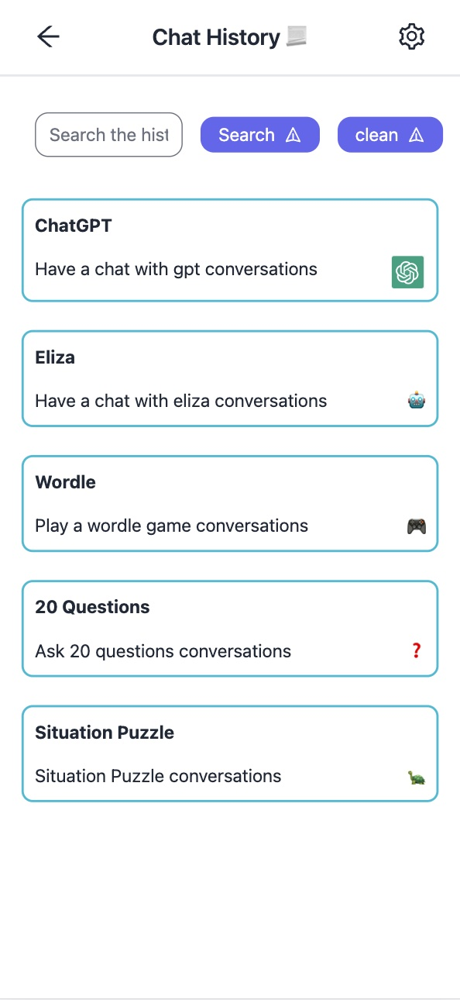
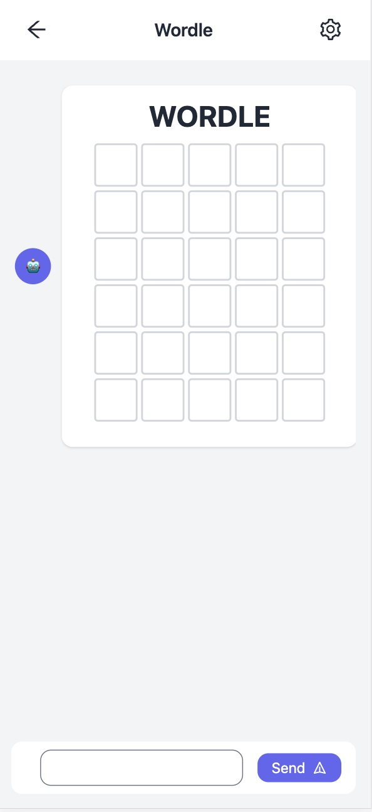
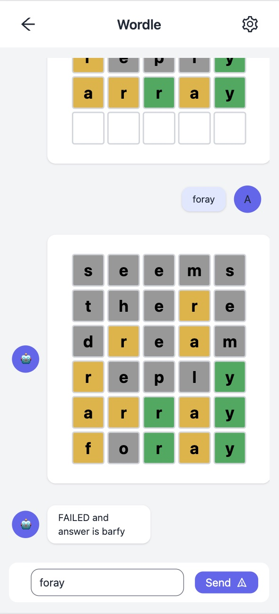
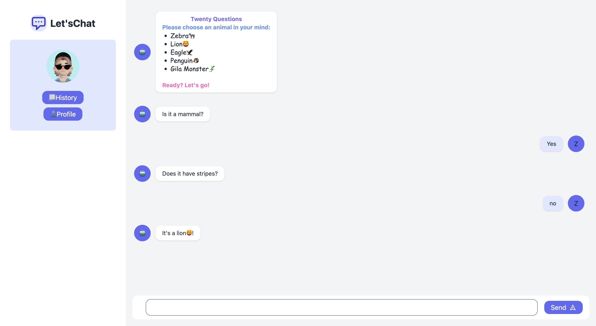
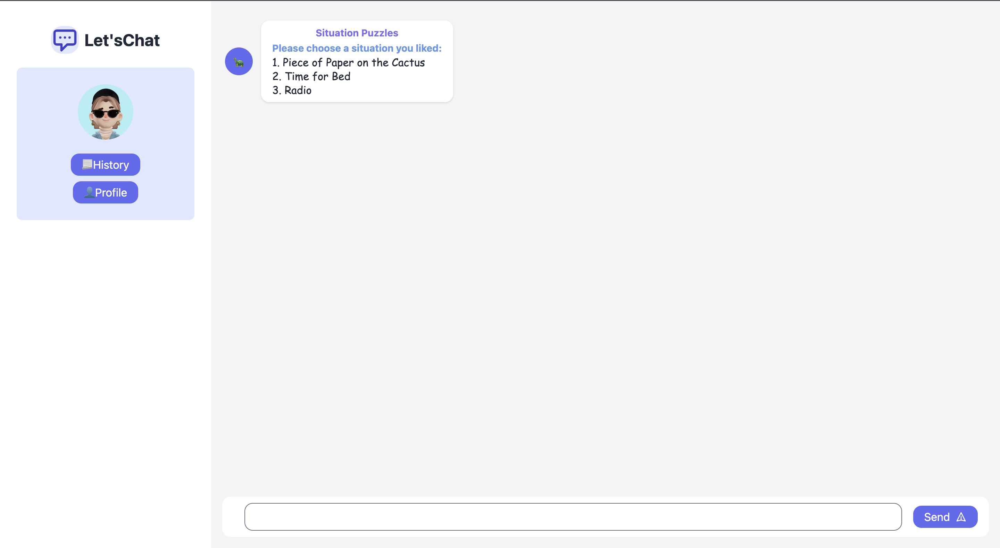
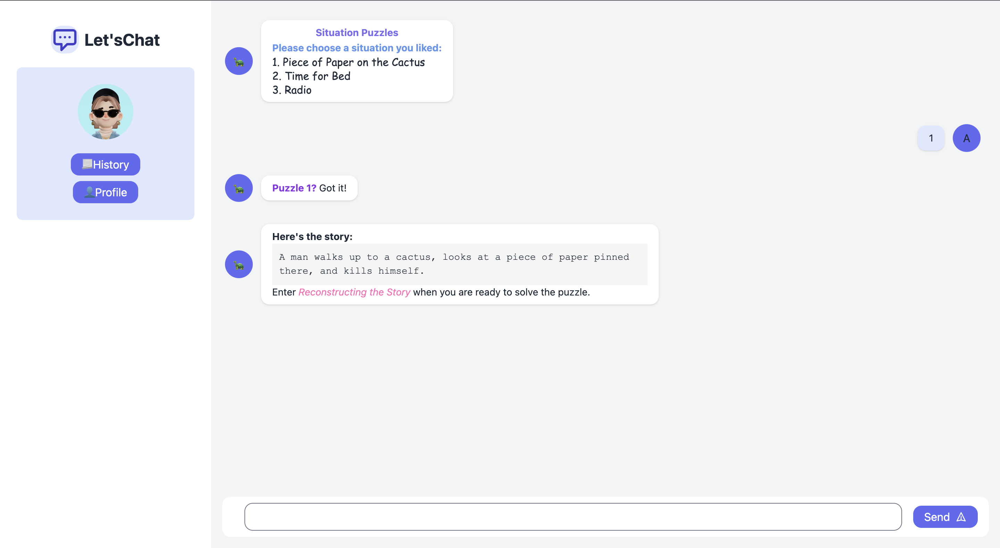
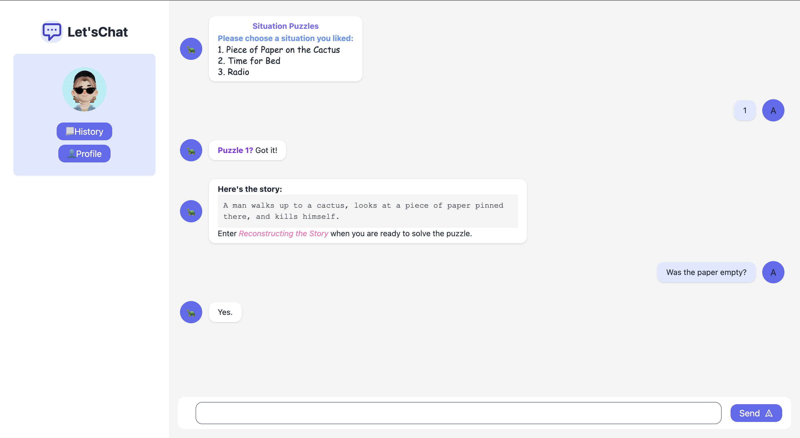
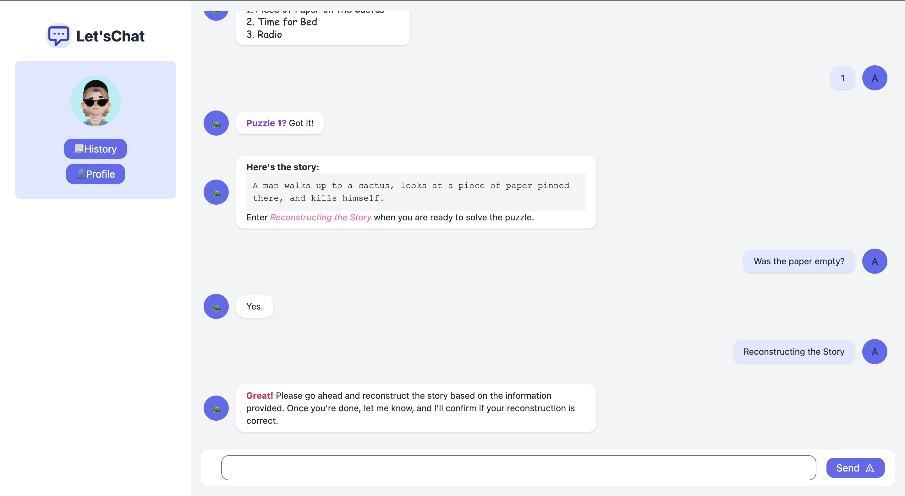
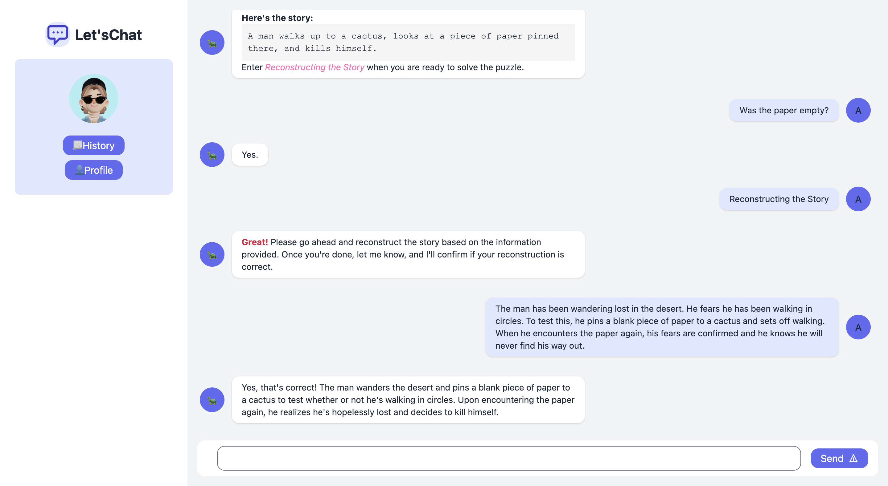

# Web Chat Project

## Project Overview

This project is a web-based platform that provides users with the ability to engage in live chat with an AI (ChatGPT), view chat history, and play text-based games. The application leverages the Python programming language in the backend and HTML, CSS, and JavaScript in the front-end to create a rich and responsive user interface.

### Key Features

* User Authentication: The platform allows new users to sign up and existing users to sign in securely, ensuring each user has access to their unique chat history and game data.

* Chat Functionality: Users can engage in real-time conversations with ChatGPT, offering an interactive and engaging AI chat experience.

* Text-based Games: The platform provides multiple games for users to enjoy, such as Wordle, Twenty Questions, and Situation Puzzle. These games offer fun and thought-provoking experiences that can help improve cognitive skills.

* Chat History: Users can review their chat history at any time, allowing them to revisit previous conversations or games. The history feature enhances the user experience by maintaining a record of user interactions with the system.

* Profile Management: Users have access to their profile where they can view their information and have the ability to log out when needed.

## Virtual Environment Setup

A Virtual Environment is necessary to develop and test the application. This is
performed in a safe, self-contained manner through Python's Virtual
Environment.

### Initialise a Python Virtual Environment

Ensure that your current working directory contains the `requirements.txt`
file, in this case it is '/venv', then use:

`$ python -m venv venv`

NOTE: Your system may have `python3` aliased as something other than `python`

### 2. Activate the new Virtual Environment

On standard Unix operating systems this would be:

`$ source venv/bin/activate`

On Windows systems:

`$ venv\Scripts\activate`

### 3. Install Requirements

The `requirements.txt` file contains all the Python dependencies that the
application requires to run. These can be downloaded and installed with:

`$ pip install -r requirements.txt`

NOTE: Your system may have `pip3` aliased as something other than `pip`

### 4. Start the server

To start the server and open pages in our browser, the follow command should be executed:

`python app.py`

## Routes Design

1. `/signin` page to sign in so that user can enter chat page
2. `/signup` page to sign up so that new user can sign up
3. `/chat` chat page
4. `/wordle` wordle game page
5. `/history` swtich to different chat snippet page
6. `/profile` page with user profile and log out

## Folder Design

1. `/auth` auth api
2. `/models` db design and connect
3. `/templates` store all the page html
4. `/static` store all the static files
   1. `/js` store all the js the pages use
   2. `/style` store all the css

## Game Introduction

### Wordle

Wordle is a word guessing game where the player has to guess a five-letter word chosen by the computer. The player has six attempts to guess the correct word by typing in a five-letter word. After each guess, the computer provides feedback by showing which letters in the guess match with the actual word. The player must use this feedback to guess the correct word within the given six attempts. It's a fun and challenging game that requires both creativity and analytical thinking.

#### How to play

After Login, the user need to redirect to `/wordle` to play the game. Here are two different ways to redirect to it.
1. simple redirect to `/wordle` with url
2. click history to redirect to history and click the wordle
   

And then the init wordle game will be displayed.

The user could guess five letter word and click to send it the result will be displayed. The count of guessing is limited to 6.

 

- 🟢 present for correct letter and position
- ⚫️ present for wrong letter and wrong position
- 🟡 present for correct letter but wrong position

### Twenty Questions

"Twenty Questions" is a classic guessing game where one player thinks of an object, and the other player tries to guess the object by asking a series of yes-or-no questions. The guessing player has 20 questions to narrow down the possibilities and make a final guess.

Here, the user is initially presented with a set of animal choices and is prompted to choose an animal in their mind. The game then begins by asking a series of questions to narrow down the selected animal. The user's answers are handled, and the next question is asked based on the previous answer. The game continues until the computer makes a final guess about the chosen animal.

#### How to play

1. After login, user can choose `20 Questions` from `📃history` page.
2. The user can see a set of animal choices, choose one of them then the system would try to guess which one did user choose by asking yes or no questions.
   

### Situation Puzzle

The "Situation Puzzle" game is a text-based game where players are presented with various situations and puzzles to solve. The game involves interacting with an AI-powered chatbot, referred to as ChatGPT, to progress through the puzzles.

#### How to play

1. After login, user can choose `Situation Puzzle` from `📃history` page.
2. The game initializes and presents player with 3 situation puzzles to choose.
   
3. Player enter the puzzle they wanted to play.
   
4. The game presents player with a story related to the situation puzzle. Player read the story to understand the context and gather relevant information by asking yes or no questions related to the puzzle.
   
5. At some point, the player may feel ready to reconstruct the story based on the information they have gathered. When they reach this stage, enter "Reconstructing the Story" to tell the ChatGPT that player is ready to solve the puzzle.
   
6. Player then share their reconstructed version of the story with ChatGPT. ChatGPT will make a decision whether player's version is acceptable and give the original version of story to user.
   
